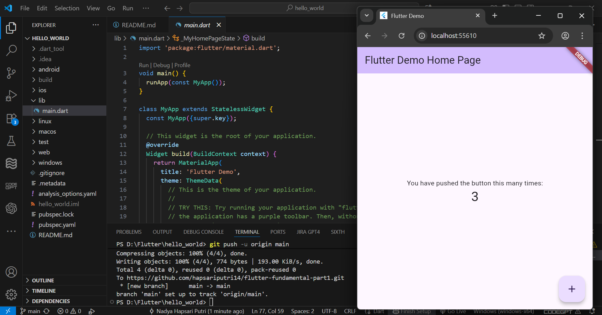
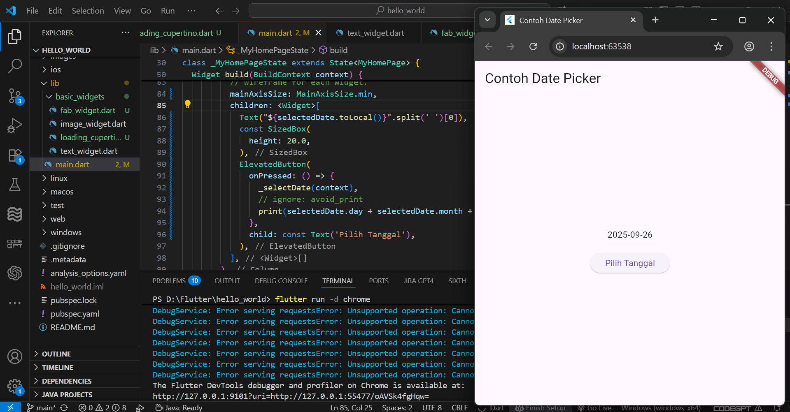

# hello_world

A new Flutter project.

Hasil Praktikum 3: Membuat Repository GitHub dan Laporan Praktikum

Hasil Praktikum 4: Menerapkan Widget Dasar

Hasil Praktikum 5: Menerapkan Widget Material Design dan iOS Cupertino

